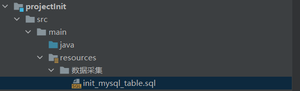

1、在mysql中创建数据库gma
create database gma

2、创建所有的表
init_mysql_table.sql  

执行sql脚本即可

3、开启canal动态topic功能
vim /usr/local/soft/canal/conf/example/instance.properties

# 监控gma数据库，不同的表发送到表名的topic上
canal.mq.dynamicTopic=gma\\..*

4、启动zk 和kafka

5、启动canal
cd /usr/local/soft/canal/bin
./startup.sh

6、导入数据
load_data.sql

7、查看kafka中是否有数据
kafka-topics.sh --list  --zookeeper  hadoop100:2181,hadoop101:2181,hadoop102:2181

kafka-console-consumer.sh --bootstrap-server  hadoop100:9092,hadoop101:9092,hadoop102:9092  --from-beginning --topic gma.user_info
